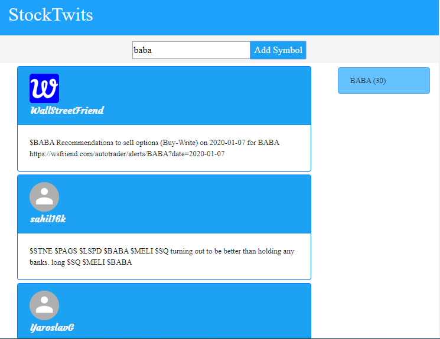

 https://w2323.herokuapp.com/

# Technologies used 
  - React.js   
  - React-Dom
  - Node
  - Express
  - SCSS
  - Heroku

  
  # Process to start the code
  
  1. Make sure that you have latest version of Node.js and npm installed.
  2. Move to the appropriate directory: cd <YOUR_PROJECT_NAME>.
  3. Move to cd client to install client dependencies. 
  4. Move to main server directory to install server dependencies.
  4. Run npm install on both client and server directories in order to install dependencies.
  5. At this point you can run npm run dev on main directory to start the application 

